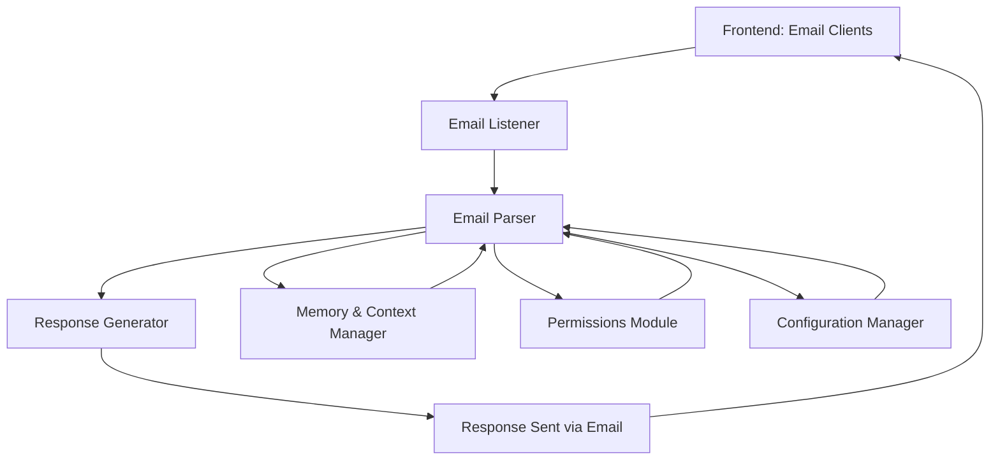

### **Project Requirements Document**

* * *

#### **Project Name**:

(temp working title) **EmailGPT: Virtual Email Assistant**

or, actually, I've probably settled on EmaiLLM. 
its's got "Email", "ai", "LLM"
it's got retronymming potential like... Electronic Mail Augmented Insourcing LLM.. in anycase in the end this would ideally be the name of our company or suite of services, and our enterprise customers would only be concerned with the names of their virtual remote employees.

first these extremely cheap helpful expert agents who never sleep or complain and are always eager to help are email-only collaborators.   then we extend the LLM chat workflow from the direct-messaging one-on-one chat that is the current LLM hotness (ChatGPT, Claud, etc.) - that also in no way  looks like the way people actually get work accomplished...  employess collaborate via group chat (Teams, Zoom, Discord, irc) and sometimes shift to direct chats, usually short "ping" type messages, and longer term topics, consensus issues, post mortems etc are done via email.. the key there is that for each response to an individual asking or telling to the entire group, they may get one reply, or they may get a reply from many but the big benefit to these ways that people actually work is that the information is shared with every recipient, and it can be resd or not read when it is convenient for each reader.  

Anyway, our agents can be strong general SMEs, and optionally a specific product,  service, confidential intellectual property, etc SME, and can be as participatory or uninvolved as the customer wishes, for far less pay than the lowest salary of any third world IT worker, likely being stronger knowledge-wise on any IT topic, always awake, never complaining or getting sick, on-call 24/7 etc. 

First our augmented LLM agents are remote virtual, email-only employees, then shortly after launch we will offer group chat participation, and from launch day our EmaiLLM/MailGPT agent will be very customizable, trainable, tuneable etc as described already, but the obvious 2.0 addition is the pre-trained expert specialist that I envision being a premium service, by the hour/token/question/answer/whatever that might ho something like this:

"Yes Hi, I need a Dan the database administrator and Sam the change management SME to join a Zoom chat overnight in next Friday's change window. Yes, that's right. Oh, I need the Oracle rdbms on linux version of Dan amd he needs to have read the Oracle backup and reocovwry strategies guides from version 8.1 and 10.0 because our new jr devops engineer will be performing a migration and upgrade on a production server, manually running the automation scripts he wrote from doing this same migration in the test environment last week with our Sr DBA who died from a reaction to the COVID vaccine the very next day.  Our devops guy is not a dba and he's pretty green, as he is a junior. I need "Dan" to be on standby in case the shit hits the fan, amd he needa to be able to instantly answer questions our jr devops guy might have. Also, Dan needs to be bonded or insured or whatever you call that "no wrong answers or hallucinations" option. The "Sam the SME" just needs to come with the Agile ScrumMaster training and have the longest context window plus RAG for up to two hours of chat/email/ticket history, and I'll need the longterm memory archive so when we use him again we can enable the "back from vacation" option so this upcoming change window's data will be fresh in his memory when we use him again next month. i think that'll about do it."

why pay a six figure salary to a live human expert whose expertise you only need sparsely, and often at inopportune times, or the expensive consultant who is happy to bill you for only working for you periodically, and at 150% of the normal outlandish billrate because it is an afterhours change window or unscheduled emergency. Why continue to burn money on these things when you can keep your experts "on ice" as it were, and just thaw them as needed and pu them back on ice when done?

wow.. that's a tangent, or at least a rambling digression,  I did not intend but all that is to say, the project is reffered to variously and inconsistently as either mailGPT or emaiLLM, and eventually will be known as Sam or Dave or Bob or whataver they wish to be called. 

---

#### **Project Objective**:

To create a virtual email assistant that can be included in team workflows by cc’ing or emailing it directly, parsing natural language tasks or requests, and responding in a non-intrusive, contextually aware manner. The assistant will dynamically adjust its behavior through feedback commands from participants and adapt to conversation style.

* * *

### **1\. Feature Breakdown**

#### **Core Features**:

*   **Email Parsing**:
    
    *   **Description**: Detect `@mentions` of EmailGPT in the email body and trigger response behavior.
    *   **Functional Requirement**:
        *   EmailGPT must detect and respond to `@EmailGPT` mentions.
        *   It should be able to identify tasks, questions, or requests embedded in natural language.
    *   **Success Criteria**: EmailGPT detects and appropriately responds to at least 90% of `@mentions` in a trial run.
*   **Natural Language Understanding**:
    
    *   **Description**: Parse tasks, requests, and questions from email content.
    *   **Functional Requirement**:
        *   The NLP module must accurately identify actionable items from the email body.
        *   Common tasks include research, finding documents, and providing clarifications.
    *   **Success Criteria**: Parsed tasks should achieve an 80% accuracy rate when evaluated against test emails.
*   **Style Matching**:
    
    *   **Description**: Adjust response tone and style to match the existing conversation.
    *   **Functional Requirement**:
        *   The system must detect the general tone (formal/informal, technical/non-technical) of the conversation and respond accordingly.
    *   **Success Criteria**: Responses are judged by users to match the thread’s tone in 90% of cases during testing.
*   **Feedback Loop via Email Commands**:
    
    *   **Description**: Users can send email commands (e.g., "mute," "increase response frequency") to modify EmailGPT's behavior.
    *   **Functional Requirement**:
        *   The system must process user-issued commands to control EmailGPT’s settings on a per-thread basis.
    *   **Success Criteria**: Command-based changes to behavior (e.g., mute/unmute) should apply within 5 seconds after being issued.
*   **Thread Memory**:
    
    *   **Description**: Maintain and recall conversation context across email threads.
    *   **Functional Requirement**:
        *   The system must retain relevant parts of the email thread to provide context-aware responses without loading the entire conversation in the model.
    *   **Success Criteria**: Responses are contextually relevant in 90% of trials involving multiple exchanges in a single thread.
*   **User Permissions**:
    
    *   **Description**: Implement access control to ensure only authorized users can configure the bot’s behavior.
    *   **Functional Requirement**:
        *   The system must restrict specific commands to authorized users based on a predefined list or rule set.
    *   **Success Criteria**: Unauthorized attempts to control behavior are blocked in 100% of cases.

#### **Enhancement Features**:

*   **Context Management**:
    
    *   **Description**: Implement long-term conversation tracking using a database or vector search for handling extended email chains.
    *   **Functional Requirement**:
        *   Store and retrieve summaries or key information for long email threads.
    *   **Success Criteria**: Responses remain contextually accurate even in extended, multi-week email chains.
*   **Dynamic Expertise Level**:
    
    *   **Description**: Allow users to adjust the expertise level of responses (e.g., junior vs. senior-level analysis).
    *   **Functional Requirement**:
        *   The system must respond based on the requested expertise level, providing more in-depth analysis when requested.
    *   **Success Criteria**: Expertise level changes are reflected in 90% of test cases where senior-level responses are needed.

#### **Optional Features**:

*   **System Templates**:
    
    *   **Description**: Respond using pre-configured templates for common tasks (e.g., scheduling, technical analysis).
    *   **Functional Requirement**:
        *   The system must identify when a pre-configured task template is applicable and generate the response accordingly.
    *   **Success Criteria**: Templates are used in 80% of applicable cases during testing.
*   **Automatic Summarization**:
    
    *   **Description**: Summarize long email chains or extract key points for briefing team members.
    *   **Functional Requirement**:
        *   The system must generate a readable, concise summary when requested.
    *   **Success Criteria**: Summaries are concise and capture the key points in 90% of cases.

* * *

### **2\. System Architecture**

**Frontend (Email Interface)**:

*   The email clients (e.g., Gmail, Outlook) serve as the user interface.
*   **Email Listener**:
    *   Continuously monitor the inbox for emails addressed to or cc’ing EmailGPT.
    *   Trigger the parsing process when a new email is detected.

**Backend**:

*   **Email Parser**:
    *   Responsible for detecting `@mentions` and extracting actionable items from the email body using natural language processing.
*   **Response Generator**:
    *   Leverages GPT-4 or equivalent to generate appropriate responses based on parsed data and conversation context.
*   **Memory and Context Manager**:
    *   Uses in-memory storage or a vector database to track context across emails in a given thread.
*   **Configuration Manager**:
    *   Handles commands issued via email to modify EmailGPT’s behavior.
*   **Permissions Module**:
    *   Manages user permissions for controlling configuration settings.
*   **Logging & Error Handling**:
    * Capture logs for system activities, errors, and exceptions to troubleshoot issues.
*   **Rate Limiting**:
    * To prevent abuse of API requests and response generation.
*   **Authentication & Authorization**:
    *   Ensure that only authorized users can interact with or modify system behavior.
*   **Scheduler**:
    *   Periodically runs processes like inbox monitoring or cleanup tasks.

* * *

### **3\. Functional Requirements Summary**

| **Feature** | **Requirement** | **Success Criteria** |
|-------------|-----------------|----------------------|
| **Email Parsing** | Detect `@mentions` and trigger response behavior. | 90% detection accuracy. |
| **Natural Language Understanding** | Parse tasks, requests, and questions from email content. | 80% accuracy in task extraction. |
| **Style Matching** | Match tone and style of the email thread. | 90% accuracy in tone matching. |
| **Feedback Loop via Commands** | Allow users to configure bot settings through commands like "mute" and "respond more frequently." | Command-based changes applied in under 5 seconds. |
| **Thread Memory** |Maintain context across email threads. | 90% accuracy in providing contextually relevant responses in multi-exchange threads. |
| **User Permissions** | Restrict control of bot configuration to authorized users. | 100% of unauthorized attempts are blocked.|
| **Context Management** | Implement long-term conversation tracking using a database or vector search. | 90% accuracy in extended thread responses. |
| **Dynamic Expertise Level** | Adjust response expertise level based on user input. | 90% success rate in correctly adjusting response depth and expertise. |

* * *

### **4\. Development Phases**

#### **Phase 1: MVP**

*   **Features to Implement**:
    *   Email Parsing
    *   Basic Response Generation
    *   User Feedback Commands (mute, unmute)
    *   Thread Memory (short-term)
*   **Timeline**:
    *   **Weeks 1-2**: Set up the email listener, parser, and mention detection.
    *   **Weeks 3-4**: Integrate GPT-4 for response generation, build basic feedback commands.
    *   **Weeks 5-6**: Implement short-term context retention for active threads.
*   **Milestone**: MVP ready for small-scale internal trial.

#### **Phase 2: Enhancements**

*   **Features to Implement**:
    *   Advanced Context Management
    *   Style Matching
    *   Dynamic Expertise Level
*   **Timeline**:
    *   **Weeks 7-10**: Implement advanced context handling using vector DB or similar.
    *   **Weeks 11-13**: Fine-tune style matching and expertise level control.

#### **Phase 3: Optional Features**

*   **Features to Implement**:
    *   System Templates
    *   Automatic Summarization
*   **Timeline**:
    *   **Weeks 14-16**: Implement task templates and auto-summarization.

* * *

